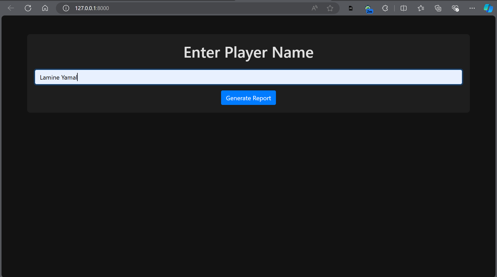
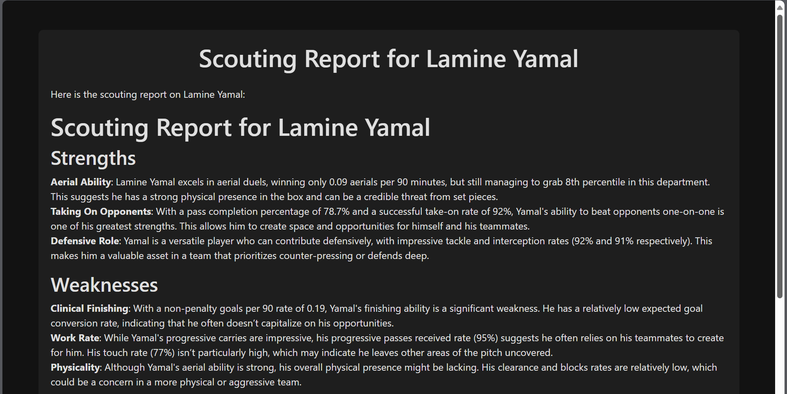
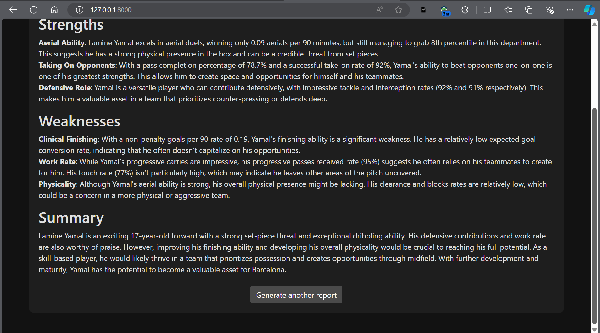

# Football Scouting Report Generator

## Overview

The Football Scouting Report Generator is a Django-based web application designed to generate scouting reports for football (soccer) players. The application uses web scraping to gather player statistics and utilizes Groq's API to generate detailed scouting reports.

## Features

- **Player Search**: Enter a football player's name to search for their profile.
- **Scouting Report Generation**: Automatically generate a scouting report with strengths, weaknesses, and summary using Groq's API.


## Screenshots

### Main Page



### Scouting Report Page




## Requirements

- Python 3.11 or later
- Django 5.1
- Bootstrap
- Tailwind CSS
- Requests library
- BeautifulSoup4
- Pandas
- Groq Python client

## Installation

1. **Clone the repository**:

    ```bash
    git clone <repository-url>
    cd <repository-directory>
    ```

2. **Create and activate a virtual environment**:

    ```bash
    python -m venv venv
    source venv/bin/activate  # On Windows, use `venv\Scripts\activate`
    ```

3. **Install the required packages**:

    ```bash
    pip install -r requirements.txt
    ```

4. **Add your Groq API key**:

    Open the `views.py` file in the `reports` directory and replace `"your-groq-api-key-here"` with your actual Groq API key:

    ```python
    client = Groq(
        api_key="your-groq-api-key-here",
    )
    ```

5. **Run the Django development server**:

    ```bash
    python manage.py runserver
    ```

6. **Navigate to `http://127.0.0.1:8000/` in your web browser to start using the application**.

## Usage

1. **Enter Player Name**: On the main page, enter the name of the player you wish to scout and click "Generate Report".
2. **View Report**: The generated scouting report will be displayed on a separate page with details about the player's strengths, weaknesses, and summary.

## Templates

- **Index Page** (`index.html`): The main page where users input the player's name.
- **Report Page** (`report.html`): Displays the generated scouting report in markdown format.

## Troubleshooting

- **Error: Missing optional dependency 'lxml'**: Install the `lxml` library if you encounter this error:

    ```bash
    pip install lxml
    ```

- **Error: Exceeded API quota**: Ensure you have a valid API key and check your Groq API usage and billing details.


